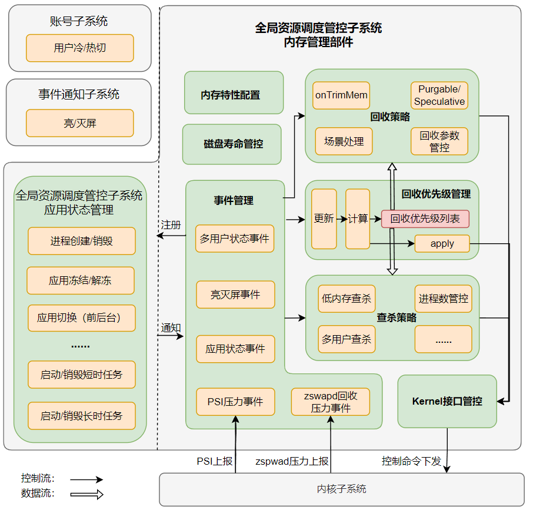

# 内存管理

-   [简介](#section_introduction)
-   [目录](#section_catalogue)
-   [框架](#section_framework)
    -   [进程回收优先级列表](#section_prio)
    -   [回收策略/查杀策略](#section_reclaim)
-   [使用说明](#section_usage)
-   [相关仓](#section_projects)

## 简介<a name="section_introduction"></a>

内存管理部件位于全局资源调度管控子系统中，基于应用的生命周期状态，更新进程回收优先级列表，通过内存回收、查杀等手段管理系统内存，保障内存供给。

## 目录<a name="section_catalogue"></a>

```
/foundation/resourceschedule/memmgr
├── common           						# 部件通用工具类
│   ├── include
│   │   ├── kernel_interface.h				# 封装了与Kernel交互的接口
│   │   ├── memmgr_log.h					# 封装了hilog，用于日志打印
│   │   └── single_instance.h				# 封装了单例模式的类模板
│   └── src
│       └── kernel_interface.cpp
│
├── interfaces
│   └── innerkits    						# 对内接口目录
|
├── sa_profile       						# 组件服务配置
|
├── services         						# 组件服务实现
|   └── memmgrservice    					# 对内接口目录
|       ├── include
|       |   ├── event						# 事件注册中心目录
|       |   ├── relcaim_priority_manager	# 进程回收优先级管理目录
|       |   ├── reclaim_strategy			# 回收策略目录
|       |   └── kill_strategy				# 查杀策略目录
|       └── src
|           ├── event
|           ├── relcaim_priority_manager
|           ├── reclaim_strategy
|           └── kill_strategry
|
└── test 									# 自测试用例目录
```
## 框架<a name="section_framework"></a>

内存管理部件主要基于事件触发回收优先级更新，并基于回收优先级管理内存回收和查杀，其框架如下所示（下图虚线右侧为本部件），主要分为如下几个模块：

1、事件管理模块：统筹管理本部件所要对外响应的事件。

2、回收优先级管理模块：基于应用和用户的变化给出回收和查杀的先后顺序列表。

3、回收策略模块：主要负责调整回收内存水线、文件页/匿名页回收比例、压缩/换出比例等回收参数，以及协调不同回收机制协同工作，保障内存中低负载下的供给性能。

4、查杀策略模块：作为回收的逻辑末端，保障内存重负载下的内存供给。

5、Kernel接口管控模块：负责将管控命令下发到Kernel。



### 进程回收优先级列表<a name="section_prio"></a>

| 优先级                                                                                   | 描述     |
|------------------------------------------------------------------------------------------|-------------|
| -1000 | 系统进程，属于该优先级的进程不会被查杀策略查杀，支持白名单配置。 |
| 0 | 前台应用 |
| 100 | 正在进行后台短时任务的应用 |
| 200 | 后台可感知应用，如正在执行导航、播放音乐等长时任务的应用。 |
| 600 | 被冻结的应用 |
| 800    | 挂起应用                                                    |

### 回收策略/查杀策略<a name="section_reclaim"></a>

查杀作为回收的逻辑末端，与回收策略一脉相承，因此两者理应使用相同的进程回收优先级列表，同时也要协同管控，协调两者触发时机，共同保障不同内存负载下的内存供给功能和性能。

- **回收策略**：回收策略是垂直内存管理的重中之重。回收策略管控了多种不同的内存回收机制，需要协调好不同机制，例如Purgeable/Speculative内存（规划）的回收要先于其他内存，再例如回收触发时机要先于低内存查杀。

  在内存低负载时，可以采用一些投机性的方式将热点文件cache在内存中以提升性能（规划）。

  内存中负载时，配置kswapd/zswapd等回收进程的内存水线（阈值）以及相应的回收参数，指导kswapd/zswapd工作。

  对于如下单点关键事件，例如大内存需求的相机场景，可以通过“场景处理”模块单点配置，根据业务需求预回收（规划）；再例如查杀场景，要停止kswapd/zswapd的基本动作，避免无效回收。

- **查杀策略**：查杀主要负责内存重负载场景。由PSI（ Pressure Stall Information ）内存压力事件触发，根据查杀内存水线，从进程回收优先级列表中选择低优先级进程进行清理。

  默认的查杀内存水线与可杀进程回收优先级对应关系如下表所示，系统开发者和产品开发者可以根据内存RAM（Random Access Memory）规格、屏幕尺寸等需求通过修改xml配置修改该对应关系。

  | 查杀内存水线 | 进程回收优先级 |
  | ------------ | -------------- |
  | 500 MB       | 800            |
  | 400 MB       | 600            |
  | 300 MB       | 200            |
  | 200 MB       | 100            |
  | 100 MB       | 0              |


## 使用说明<a name="section_usage"></a>

系统开发者可以通过配置productdefine/common/products下的产品定义json文件，增加或移除本部件，来启用或停用本部件。

` "resourceschedule:plugins/memmgr":{} `

"resourceschedule:plugins/memmgr":{}

## 相关仓<a name="section_projects"></a>

全局资源调度子系统

resource_schedule_service


